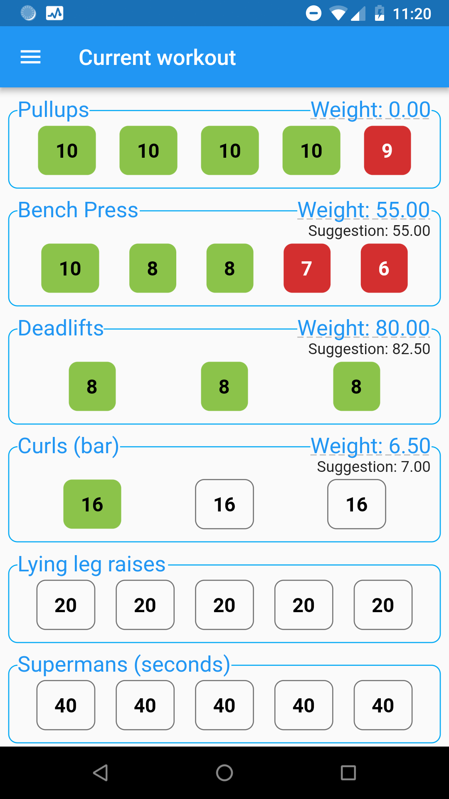

# Knuffiworkout

A workout app for Android written in Flutter and Firebase.

[Download on the Play store](https://play.google.com/store/apps/details?id=de.fmutzel.knuffiworkout)




## Getting Started

1. Set up [Flutter](http://flutter.io) with the editor of your choice.
1. Create a [Firebase](http://firebase.google.com) account
1. Set up a Firebase project for knuffiworkout.
   Instructions for creating a Firebase project in Flutter can be found in the [Codelab](https://codelabs.developers.google.com/codelabs/flutter-firebase/#4).
   Make sure to follow through steps 5 and 6:
    1. The Android package name should match `AndroidManifest.xml` (per default de.fmutzel.knuffiworkout)
    1. Add SHA fingerprints for your projects as described in [Authenticating your Client](https://developers.google.com/android/guides/client-auth).
    1. Download `google-services.json` from the Firebase console and place it in android/app.
1. Configure your Firebase project to allow sign-in with Google in the Authentication tab.
1. Create a Firebase database and set up rules to allow read/write access for each user's data:
```
{
  "rules": {
    "user": {
      "$uid": {
        ".read": "$uid === auth.uid",
        ".write": "$uid === auth.uid"
      }
    }
  }
}
```
1. Run the project using `flutter run` or open it in your IDE.

## Contributing

Pull requests welcome! :)

I don't have an iOS device (nor do I have an Apple developer account or a Mac with XCode),
so the iOS code is just the default from the Flutter framework.

### Regenerating built_value files
The built_value file `model.g.dart` can be regenerated from `model.dart` using
```
flutter packages pub run build_runner build --delete-conflicting-outputs
```

## Feature wishlist
* Use charts_flutter instead of custom drawn charts
* Presets for other popular workouts (5x5, Starting Strength, ...)